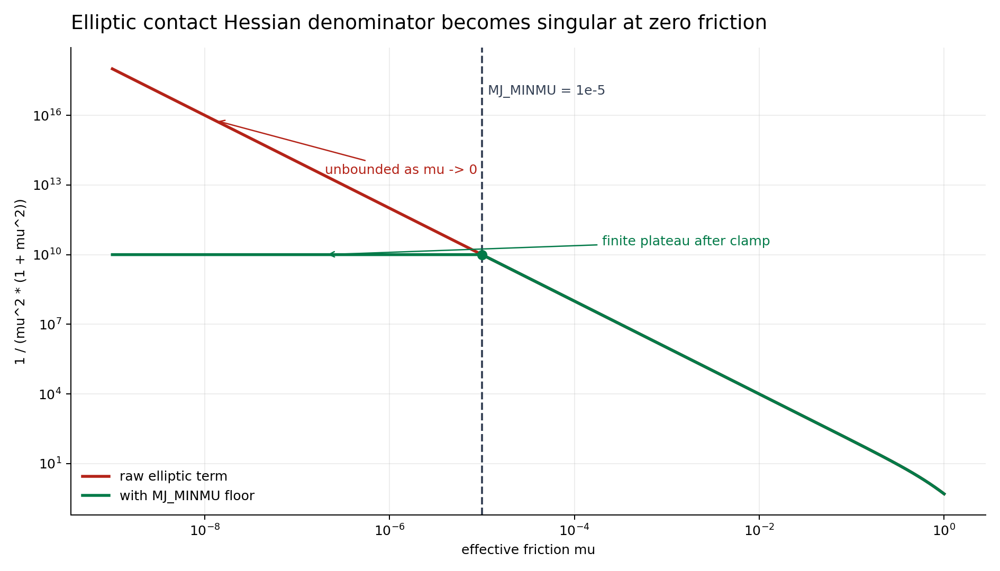
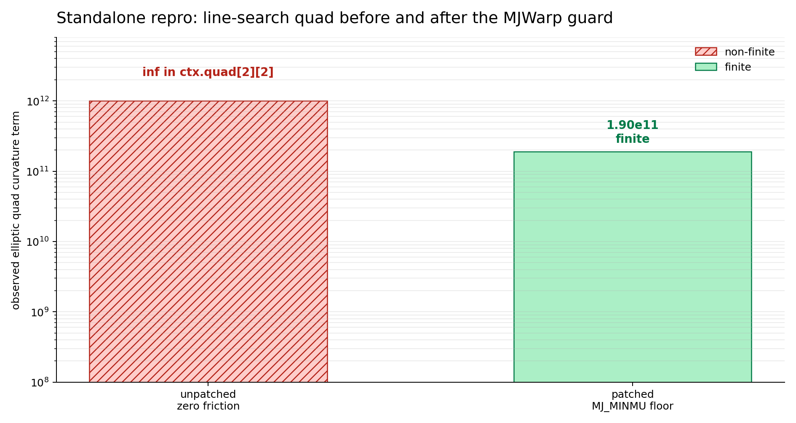

# Newton/MJWarp Elliptic Friction NaN Investigation

**Author:** ClawLabby  
**Date:** 2026-06-06  
**Status:** Root cause identified, local fixes implemented and validated

## Summary

Newton-supplied contacts can bypass MJWarp's collision-time friction floor. When those contacts contain zero or very small friction, MJWarp's elliptic-cone solver can compute non-finite intermediate values. The clearest repro writes zero friction into `d.contact.friction` after collision, calls `mjw.make_constraint()`, and then runs the Newton solver. Before the fix, the line-search quad contains `inf`; after the fix, all checked solver outputs remain finite.

The failure is specific to the elliptic cone path because that path treats the normal and tangential contact rows as a coupled cone and repeatedly divides by terms derived from the primary friction coefficient `mu`. Pyramidal cones split friction into separate linearized rows and do not use the same coupled-cone denominator.

The MJWarp patch is included here:

- [`mjwarp-elliptic-zero-friction.diff`](mjwarp-elliptic-zero-friction.diff)
- [`repro_zero_friction_elliptic.py`](repro_zero_friction_elliptic.py)

Generated visuals:





## Branches Reviewed

Newton:

- Checkout: `/home/horde/claw/git/newton`
- Branch: `claw/investigate-elliptic-mjwarp-nans`
- Commit: `4d159e0a3f25b53e7d692a1a457ba45e8a3d10fd`
- Note: checkout has one unrelated dirty file, `docs/images/examples/resize.sh`

MJWarp:

- Checkout: `/home/horde/claw/git/mujoco_warp`
- Branch: `claw/fix-elliptic-small-friction-v3.6.0`
- Commit: `51adb51bd6afdb2022011310913fb32ebcbde8a3`
- Status: clean

Unpatched comparison worktree:

- Checkout: `/home/horde/claw/git/mujoco_warp-before-elliptic-nan`
- Commit: `d9bcc32` (`Bump MuJoCo Warp to v3.6.0 (#1214)`)

## Observed Failure

The recent report was: NaNs occur with elliptic friction cones, but not with pyramidal friction cones.

Earlier DexSuite Kuka Allegro NaN work was also using elliptic cones:

```python
MJWarpSolverCfg(... cone="elliptic", ...)
```

The new investigation focused on code paths that differ materially between elliptic and pyramidal contact handling. The important difference is not the high-level Newton integrator; it is the elliptic contact math inside MJWarp.

## MJWarp Contact Invariant

MJWarp already has a minimum-friction constant:

```python
MJ_MINMU = mujoco.mjMINMU
```

The MJWarp model loader warns when relevant friction dimensions are below this floor:

```python
if friction[idx] < types.MJ_MINMU:
  warnings.warn(
    f"{name} {id_}: friction[{idx}] ({friction[idx]}) < MJ_MINMU ({types.MJ_MINMU}) with condim={condim} may cause NaN"
  )
```

The normal MJWarp collision path also clamps mixed contact friction before writing the contact:

```python
friction = vec5(
  wp.max(MJ_MINMU, friction[0]),
  wp.max(MJ_MINMU, friction[1]),
  wp.max(MJ_MINMU, friction[2]),
  wp.max(MJ_MINMU, friction[3]),
  wp.max(MJ_MINMU, friction[4]),
)
```

That means ordinary MJWarp-generated contacts normally satisfy:

```text
contact.friction[i] >= MJ_MINMU
```

The bug is that the solver assumed this invariant, but the contact buffer is also a public data path. Newton's `use_mujoco_contacts=False` conversion writes contacts directly into MJWarp `Data`, so it could supply zero friction even though MJWarp's own collision writer would not.

## Why Elliptic Fails

The elliptic solver path derives an effective friction value:

```python
mu = friction[0] * impratio_invsqrt
```

That value is used in line-search and Hessian-style terms. The most direct singular denominator is:

```python
mu2 = mu * mu
dm = math.safe_div(efc_D_in[worldid, efcid0], mu2 * (1.0 + mu2))
```

If `friction[0] == 0`, then `mu == 0`, so the denominator becomes zero. The observed unpatched repro writes:

```text
ctx.quad[2][2] = inf
```

This can poison subsequent cost, line-search, gradient, or state-update work. In the one-step repro, `efc.force` and `qacc` were still finite, but the non-finite solver workspace is enough to explain later instability in larger Newton/MJWarp rollouts.

Pyramidal cones avoid this exact failure because they do not evaluate the same coupled elliptic cone denominator. They represent friction constraints with linearized directions, so zero material friction does not enter this elliptic `mu^2 * (1 + mu^2)` denominator.

## Fix

The fix has two layers.

### 1. MJWarp Solver Guard

MJWarp should be robust even when contacts come from an external producer. The patch centralizes the elliptic friction floor:

```python
@wp.func
def _elliptic_mu(friction0: float, impratio_invsqrt: float) -> float:
  return wp.max(types.MJ_MINMU, friction0) * impratio_invsqrt
```

Then every elliptic solver path that previously used `friction[0] * impratio_invsqrt` now calls `_elliptic_mu()`:

- `_eval_elliptic`
- `linesearch_parallel_fused`
- `linesearch_iterative`
- `linesearch_prepare_quad`
- `update_constraint_efc`
- `update_gradient_JTCJ_sparse`
- `update_gradient_JTCJ_dense`

The constraint setup path also floors the friction ratio terms used for elliptic contact weighting:

```python
fri0 = wp.max(types.MJ_MINMU, friction[0])
frii = wp.max(types.MJ_MINMU, friction[dimid - 1])
fri = fri0 * fri0 / (frii * frii)
```

### 2. Newton Contact Conversion Guard

Newton should also respect MJWarp's contact invariant when it supplies contacts to MJWarp. The Newton branch adds:

```python
MJ_MINMU = 1.0e-5
```

and floors all five contact friction entries during:

- Newton contact parameter construction
- post-scaling contact conversion into MJWarp

This prevents Newton from writing sub-floor friction into MJWarp `Data`, including after per-contact friction scaling.

## Regression Tests

### MJWarp Test

Added to `mujoco_warp/_src/solver_test.py`:

```python
@parameterized.product(
  jacobian=(mujoco.mjtJacobian.mjJAC_DENSE, mujoco.mjtJacobian.mjJAC_SPARSE),
  ls_parallel=(False, True),
)
def test_elliptic_zero_contact_friction_has_finite_linesearch_quad(self, jacobian, ls_parallel):
  xml = """
  <mujoco>
    <option cone="elliptic" solver="Newton" iterations="20" ls_iterations="20" timestep="0.002"/>
    <worldbody>
      <geom type="plane" size="2 2 .1" condim="3" friction="1 0 0"/>
      <body pos="0 0 .095">
        <freejoint/>
        <geom type="sphere" size=".1" mass="1" condim="3" friction="1 0 0"/>
      </body>
    </worldbody>
  </mujoco>
  """
  _, _, m, d = test_data.fixture(xml=xml, overrides={"opt.jacobian": jacobian, "opt.ls_parallel": ls_parallel})

  # Normal MJWarp collision clamps contact friction. This deliberately models
  # an external producer writing contacts directly into Data.
  mjw.step(m, d)
  self.assertGreater(d.nacon.numpy()[0], 0)
  d.contact.friction.fill_(types.vec5(0.0, 0.0, 0.0, 0.0, 0.0))

  mjw.make_constraint(m, d)
  ctx = solver.create_solver_context(m, d)
  solver._solve(m, d, ctx)

  nefc = d.nefc.numpy()[0]
  self.assertTrue(np.isfinite(ctx.quad.numpy()[0, :nefc]).all())
  self.assertTrue(np.isfinite(d.efc.force.numpy()[0, :nefc]).all())
  self.assertTrue(np.isfinite(d.qacc.numpy()).all())
```

This test covers:

- Dense and sparse Jacobians
- Iterative and parallel line search
- The exact external-contact invariant violation that Newton could trigger

### Newton Test

Added to `newton/tests/test_mujoco_solver.py`:

```python
def test_elliptic_newton_contacts_floor_small_friction(self):
  """Newton-supplied contacts use MJWarp's friction floor for elliptic cones."""
```

The test builds a zero-friction Newton sphere on a zero-friction ground plane, uses `SolverMuJoCo(... use_mujoco_contacts=False, cone="elliptic")`, steps several times, then verifies:

- contacts exist
- `solver.mjw_data.contact.friction >= 1.0e-5`
- `qpos`, `qvel`, `qacc`, and `efc.force` are finite

## Before/After Repro

The standalone repro intentionally writes zero friction into `d.contact.friction` after MJWarp collision. That simulates an external contact producer bypassing MJWarp's collision-time friction floor.

Script:

```bash
PYTHONPATH=/path/to/mujoco_warp uv run --extra sim --with pytest \
  python mjwarp-elliptic-friction-nan/repro_zero_friction_elliptic.py
```

### Before

Checkout:

```text
/home/horde/claw/git/mujoco_warp-before-elliptic-nan
commit d9bcc32
```

Observed output:

```text
version=before
nefc= 3
quad_finite= False
quad= [[18.089473724365234, -572.0704345703125, 4522.859375], [0.0, -0.0, 0.0], [0.0, 0.0, inf]]
efc_force_finite= True
qacc_finite= True
```

The important value is the final `inf` in the elliptic quad. The single-step force and acceleration stayed finite in this tiny repro, but the solver workspace is already non-finite.

### After

Checkout:

```text
/home/horde/claw/git/mujoco_warp
commit 51adb51bd6afdb2022011310913fb32ebcbde8a3
```

Observed output:

```text
version=after
nefc= 3
quad_finite= True
quad= [[18.089473724365234, -572.0704345703125, 4522.859375], [1.3799113730783574e-05, -0.00021819499670527875, 0.0], [0.0, 0.0, 189999972352.0]]
efc_force_finite= True
qacc_finite= True
```

The curvature term is still large, as expected for a tiny friction floor, but it is finite and therefore usable by the rest of the solver.

## Validation Results

Fresh validation on 2026-06-06:

```bash
PYTHONPATH=/home/horde/claw/git/mujoco_warp uv run --extra sim --with pytest \
  pytest -q /home/horde/claw/git/mujoco_warp/mujoco_warp/_src/solver_test.py \
  -k 'elliptic_zero_contact_friction_has_finite_linesearch_quad or init_linesearch or parallel_linesearch or constraint_update'
```

Result:

```text
25 passed, 19 deselected in 4.08s
```

Newton focused suite:

```bash
uv run --extra sim --with pytest \
  pytest -q newton/tests/test_mujoco_solver.py::TestMuJoCoSolverNewtonContacts
```

Result:

```text
3 passed, 2 warnings in 6.35s
```

The two warnings are expected MJWarp model-load warnings for zero-friction geoms:

```text
geom 0: friction[0] (0.0) < MJ_MINMU (1e-05) with condim=3 may cause NaN
geom 1: friction[0] (0.0) < MJ_MINMU (1e-05) with condim=3 may cause NaN
```

Those warnings are useful: they flag the problematic model input. The new Newton conversion and MJWarp solver guards prevent that input from becoming a non-finite solver workspace value.

## Why the Fix Belongs in Both Places

The Newton clamp is the right producer-side fix. It keeps Newton-generated contacts consistent with MJWarp's own collision-generated contacts.

The MJWarp solver guard is also necessary. Solver kernels are the last consumer before the singular math. If any other future external contact producer writes small friction into `Data`, MJWarp should not turn that into `inf` or `NaN`.

Relying only on producer-side clamping leaves MJWarp brittle. Relying only on solver-side clamping leaves Newton writing contacts that violate MJWarp's documented warning/invariant. The two together make the contract explicit and robust.

## Remaining Risk

This investigation validates the specific elliptic zero-friction failure mode, not every possible source of Newton/MJWarp NaNs.

Remaining areas worth watching:

- Other external contact producers that write directly to MJWarp `Data`
- Nonzero but extremely small friction below `MJ_MINMU`
- Friction dimensions beyond `friction[0]` for higher `condim` contacts
- Any solver code added later that computes elliptic `mu` without using `_elliptic_mu()`

The current MJWarp patch addresses the elliptic solver paths found in this review, including line-search, constraint update, and dense/sparse Hessian paths.
